# Giraffe generator by rybka 🐟 plum

Giraffe generator made for Motorola Science Cup contest

## Usage

### Running
`python3` is required to run `run.py` script which is used to simplify
user interface and putting information to `main`

`main` reads data from stdin and generates a single image

### Parameters
Executing `python3 run.py [giraffe_index]` will generate
a girafe of provided index. (0 for Reticulated, and so on)

## Code
### Requirements
  - `c++20 `
  - `libpng` and `libpng-config`
  - `python3` version `3.6+`

Running `make` build `main` program.

# Images
## Reticulated giraffe
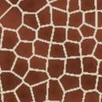
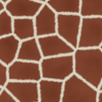
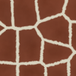
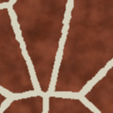
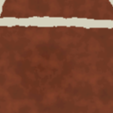

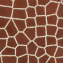
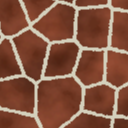

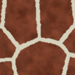
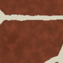

## West African giraffe
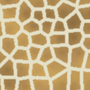
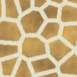
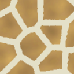
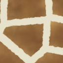
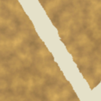

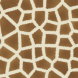
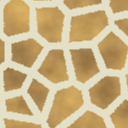
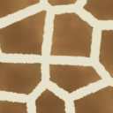
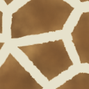

## Nubian giraffe
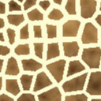
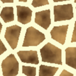
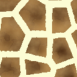

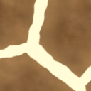

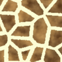
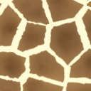
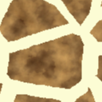
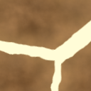

## Kordofan giraffe
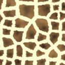
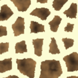
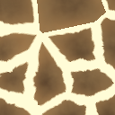
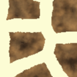
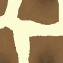

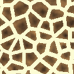
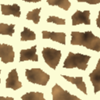

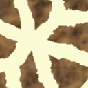
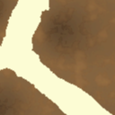

## Angolan giraffe
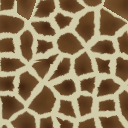
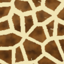

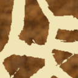
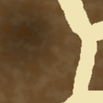

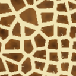
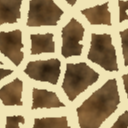
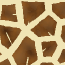
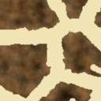
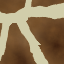